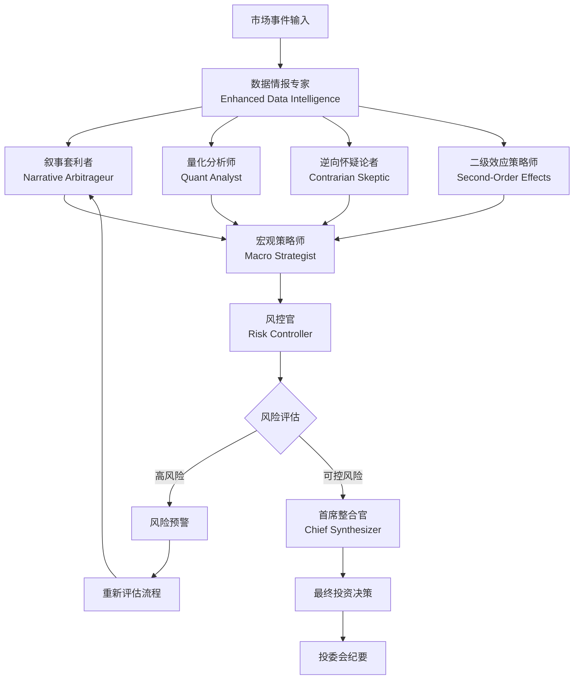

# 🏛️ 增强版多智能体投研分析系统

> **基于顶级投研团队实践的专业级金融分析AI系统**

## 🎯 系统概述

本系统模拟顶级对冲基金内部投研团队的"辩证与博弈"过程，通过8个专业智能体角色的协作，提供深度的投资分析和决策支持。

### 🔥 核心创新

- **🎭 真实角色建模** - 基于华尔街投研团队实际工作流程设计
- **🔗 舆情API集成** - 接入团队舆情收集部门的专业数据
- **🧠 多维度分析** - 数据情报、叙事分析、量化建模、风险控制、宏观策略
- **⚡ 智能路由** - 基于风险评估的动态工作流路由
- **📊 投委会纪要** - 生成完整的投资委员会会议记录

## 🏗️ 系统架构

### 智能体角色体系



### 八大专业角色

#### 1. 🔍 增强版数据情报专家 (Enhanced Data Intelligence Specialist)
- **原型**: Bloomberg Terminal操作员 + 数据科学家
- **职责**: 多源数据采集、舆情分析、异常检测、数据质量评估
- **增强功能**: 集成舆情收集部门API，提供实时舆情数据支撑

#### 2. 📈 叙事套利者 (Narrative Arbitrageur)  
- **原型**: 华尔街趋势交易员，Meme股票猎手
- **职责**: 挖掘评估舆情核心叙事，判断传播潜力与市场影响力

#### 3. 🔢 一级效应量化分析师 (First-Order Impact Quant)
- **原型**: 严谨的卖方分析师，数据科学家
- **职责**: 量化舆情事件对财务模型的直接影响

#### 4. 🎯 逆向怀疑论者 (Contrarian Skeptic)
- **原型**: 激进买方调查员，专业做空机构
- **职责**: 挑战主流观点，发掘被忽视的风险和价值

#### 5. 🌐 二级效应策略师 (Second-Order Effects Strategist)
- **原型**: 宏观对冲基金经理，博弈论大师
- **职责**: 分析连锁反应，竞争格局、监管政策、产业链变化

#### 6. 🌍 宏观策略师 (Macro Strategist)
- **原型**: 全球宏观对冲基金策略师
- **职责**: 宏观经济分析、政策影响评估、跨市场关联分析

#### 7. 🛡️ 独立风控官 (Risk Controller)
- **原型**: 投资委员会风控负责人
- **职责**: 独立风险评估、压力测试、合规检查、风险预警

#### 8. 👑 首席整合官 (Chief Synthesizer)
- **原型**: 基金投资决策委员会主席(CIO)
- **职责**: 综合所有观点，形成最终投资决策和行动建议

## 🚀 快速开始

### 环境配置

1. **设置环境变量**:
```bash
# LLM网关配置
export LLM_GATEWAY_URL="http://localhost:8002/v1/chat/completions"
export LLM_MODEL="deepseek-v3"

# 舆情API配置（重要！）
export SENTIMENT_API_URL="http://your-sentiment-api.com"
export SENTIMENT_API_KEY="your-api-key"

# 其他配置
export ENVIRONMENT="development"
export DEBUG="true"
```

2. **安装依赖**:
```bash
pip install -r requirements.txt
```

### 启动服务

```bash
cd apps/rag-analysis
python src/main.py
```

服务将在 `http://localhost:8010` 启动

### API调用示例

```python
import httpx
import asyncio

async def analyze_market_event():
    client = httpx.AsyncClient()
    
    request_data = {
        "topic": "某科技公司发布AI新产品",
        "headline": "革命性AI产品引发市场热议",
        "content": "该公司今日发布了新一代AI产品，预计将显著提升行业竞争力...",
        "symbols": ["000001", "600036"],
        "time_horizon": "medium",
        "risk_appetite": "balanced",
        "region": "CN",
        "max_iterations": 2
    }
    
    response = await client.post(
        "http://localhost:8010/v1/analysis/execute",
        json=request_data
    )
    
    result = response.json()
    print("分析结果:", result)
    
    await client.aclose()

# 运行分析
asyncio.run(analyze_market_event())
```

## 🔧 舆情API集成指南

### API接口规范

您的舆情收集部门需要提供以下API接口：

#### 1. 综合舆情查询
```
POST /api/v1/sentiment/query
Content-Type: application/json

{
  "keywords": ["关键词1", "关键词2"],
  "symbols": ["股票代码1", "股票代码2"],
  "time_range": "24h",
  "data_sources": ["news", "social", "research"],
  "max_results": 100
}
```

**响应格式**:
```json
{
  "data_points": [
    {
      "id": "content_id",
      "title": "标题",
      "content": "内容",
      "source": "来源",
      "source_type": "news|weibo|wechat|research_report",
      "publish_time": "2024-01-01T12:00:00Z",
      "sentiment_score": 0.8,
      "sentiment_label": "positive",
      "confidence": 0.9,
      "influence_score": 0.7,
      "mentioned_stocks": ["000001"],
      "key_topics": ["AI", "科技"]
    }
  ],
  "overall_sentiment": {
    "positive": 0.6,
    "negative": 0.2, 
    "neutral": 0.2
  },
  "hot_topics": [...],
  "sentiment_anomalies": [...]
}
```

#### 2. 实时舆情摘要
```
POST /api/v1/sentiment/realtime
{
  "symbols": ["000001", "600036"],
  "time_window": "1h",
  "metrics": ["sentiment_score", "volume", "trend"]
}
```

#### 3. 新闻流分析
```
POST /api/v1/news/flow-analysis
{
  "keywords": ["AI", "科技"],
  "time_range": "24h",
  "analysis_types": ["sentiment", "impact", "credibility"]
}
```

#### 4. 社交媒体热度
```
POST /api/v1/social/buzz-analysis
{
  "symbols": ["000001"],
  "platforms": ["weibo", "wechat", "zhihu"],
  "metrics": ["mention_volume", "sentiment", "viral_content"]
}
```

#### 5. 研报情感分析
```
POST /api/v1/research/sentiment
{
  "symbols": ["000001"],
  "report_types": ["analyst_report", "institution_research"],
  "time_range": "30d"
}
```

### 配置舆情API

在 `src/config/settings.py` 中配置您的舆情API：

```python
@dataclass  
class SentimentAPIConfig:
    base_url: str = "http://your-sentiment-api.com"
    api_key: str = "your-secret-key"
    timeout: float = 30.0
    max_retries: int = 3
```

## 📊 分析结果示例

系统返回的增强版分析结果包含：

```json
{
  "success": true,
  "message": "增强版多智能体分析完成",
  "enhanced_findings": {
    "narrative": {
      "one_liner": "AI产品发布引发科技股热潮",
      "meme_potential": 0.85,
      "lifecycle_days": 7
    },
    "data_intelligence": {
      "market_snapshot": {...},
      "sentiment_indicators": {...},
      "data_quality_score": 0.87
    },
    "risk_control": {
      "overall_risk_score": 0.35,
      "risk_control_recommendations": [...]
    },
    "macro_strategic": {
      "strategic_market_outlook": {...},
      "regime_change_indicators": [...]
    }
  },
  "enhanced_decision": {
    "action": "buy",
    "confidence": 0.78,
    "risk_adjusted_confidence": 0.72,
    "macro_alignment_score": 0.85
  },
  "committee_minutes": {
    "meeting_id": "meeting-20241201120000",
    "participants": ["数据情报专家", "叙事套利者", ...],
    "key_debates": [...],
    "final_resolution": "buy"
  }
}
```

## 🔍 系统特色功能

### 1. 智能工作流路由
- 基于风险评估自动调整分析流程
- 高风险情况自动触发重新评估或中止流程
- 支持多轮迭代优化决策质量

### 2. 投资委员会纪要
- 自动生成完整的会议记录
- 记录各智能体的关键观点和分歧
- 追踪决策过程和共识形成

### 3. 数据质量评估
- 多维度数据质量评分
- 数据源可靠性评估
- 异常数据自动识别和预警

### 4. 性能监控
- 实时监控各智能体性能
- 响应时间和准确率统计
- 系统健康状态报告

## 🛠️ 开发指南

### 添加新的智能体角色

1. 在 `src/services/agents/` 下创建新的智能体类
2. 继承 `BaseAgent` 并实现 `analyze` 方法
3. 在 `src/services/graph_workflow.py` 中注册新角色
4. 更新配置文件添加角色配置

### 自定义分析逻辑

智能体的分析逻辑通过精心设计的提示词实现，您可以：

- 修改系统提示词以调整分析视角
- 添加特定领域的专业知识
- 集成外部数据源和API
- 实现自定义的回退机制

### 扩展数据源

系统支持灵活的数据源扩展：

- 在 `SentimentAPIClient` 中添加新的API接口
- 实现数据格式转换和标准化
- 添加数据质量验证逻辑

## 📈 性能优化

- **并行处理**: 智能体分析任务并行执行，显著提升响应速度
- **缓存机制**: 支持结果缓存，避免重复计算
- **连接池**: HTTP客户端使用连接池，提升网络效率
- **容错设计**: 完善的错误处理和回退机制

## 🔒 安全考虑

- API密钥安全存储
- 请求频率限制
- 数据传输加密
- 访问权限控制

## 📞 技术支持

如需技术支持或有任何问题，请联系开发团队。

---

**这是一个模拟顶级投研团队工作流程的专业级AI系统，为您的投资决策提供全方位的智能支撑！** 🚀
