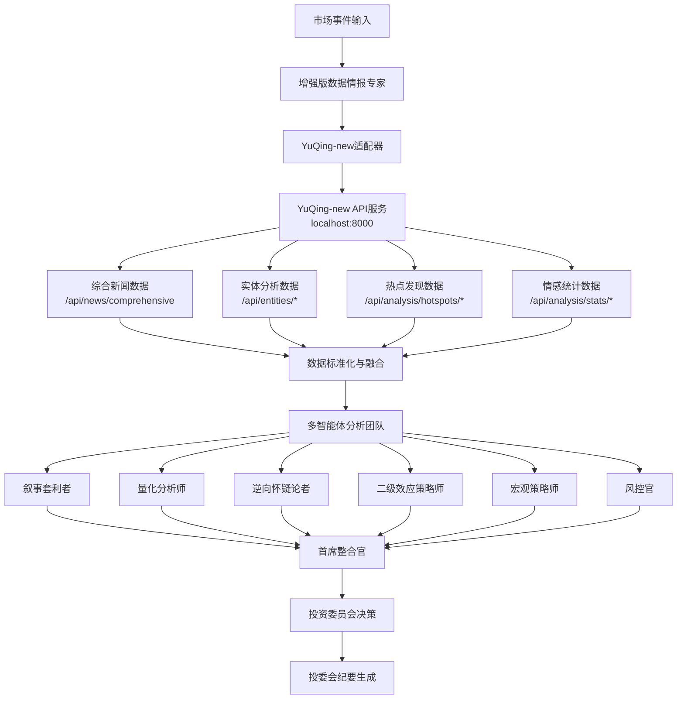

# 🔗 舆情服务与RAG分析系统集成指南

## 📋 集成概述

本指南详细说明如何将`yuqing-sentiment`舆情分析系统与我们的`rag-analysis`多智能体投研系统进行无缝对接，实现专业级的舆情驱动投资分析。

### 🎯 集成目标

- ✅ **数据源统一** - `yuqing-sentiment`作为主要舆情数据源
- ✅ **API标准化** - 统一的数据接口和格式
- ✅ **实时分析** - 基于最新舆情的投资决策
- ✅ **容错设计** - 多级回退机制确保系统稳定性
- ✅ **性能优化** - 并行数据处理和智能缓存

## 🏗️ 系统架构



## 🚀 快速集成步骤

### 第一步：环境配置

1. **启动`yuqing-sentiment`服务**:
```bash
cd apps/yuqing-sentiment
python src/main.py
# 服务运行在 http://localhost:8000
```

2. **配置环境变量**:
```bash
# 在您的RAG分析系统中设置
export YUQING_API_URL="http://localhost:8000"
export LLM_GATEWAY_URL="http://localhost:8002/v1/chat/completions" # 根据实际情况修改
export ENVIRONMENT="development"
```

3. **验证连通性**:
```bash
# 检查YuQing-new健康状态
curl http://localhost:8000/health

# 检查API可用性
curl "http://localhost:8000/api/news/stats"
```

### 第二步：启动增强版RAG分析系统

```bash
cd apps/rag-analysis
python src/main.py
# 服务运行在 http://localhost:8010
```

### 第三步：运行集成测试

```bash
python tools/development/yuqing_integration_demo.py
```

## 📊 `yuqing-sentiment` API能力映射

### 核心API接口对应关系

| RAG+Agent需求 | YuQing-new API接口 | 数据类型 | 用途 |
|---------------|-------------------|----------|------|
| **综合舆情数据** | `/api/news/comprehensive` | 新闻+情感+实体 | 主要数据源 |
| **股票影响分析** | `/api/entities/companies` | 公司实体分析 | 股票关联度评估 |
| **市场热点监控** | `/api/analysis/hotspots/discover` | 热点发现 | 市场趋势识别 |
| **情感趋势分析** | `/api/analysis/stats/sentiment` | 情感统计 | 情感变化追踪 |
| **实体识别** | `/api/entities/entities/extract` | 实时实体提取 | 文本智能解析 |
| **行业影响评估** | `/api/entities/industries` | 行业分析 | 宏观影响评估 |
| **关键事件追踪** | `/api/entities/events` | 事件分析 | 事件驱动分析 |

### 数据流转换

```python
# YuQing-new原始数据格式
yuqing_response = {
    "data": [
        {
            "news": {
                "id": "news_id",
                "title": "新闻标题", 
                "content": "新闻内容",
                "source": "cailian",
                "published_at": "2024-01-01T12:00:00Z"
            },
            "sentiment_analysis": {
                "sentiment_label": "positive",
                "confidence_score": 0.85,
                "market_impact_level": "high"
            },
            "entity_analysis": {
                "companies": [{"name": "腾讯", "stock_code": "00700"}],
                "industries": [{"name": "科技", "impact_direction": "positive"}]
            }
        }
    ]
}

# 转换为RAG+Agent标准格式
standard_format = {
    "overall_sentiment": {"positive": 0.6, "negative": 0.2, "neutral": 0.2},
    "sentiment_trend": [...],
    "hot_topics": [...],
    "data_quality": 0.9,
    "total_mentions": 50,
    "data_source": "YuQing-new"
}
```

## 🔧 关键技术实现

### 1. YuQing适配器 (`apps/rag-analysis/src/analysis/services/yuqing_adapter.py`)

**核心功能**:
- ✅ API调用封装和错误处理
- ✅ 数据格式标准化转换
- ✅ 并行数据获取优化
- ✅ 股票代码匹配算法
- ✅ 实体关联性分析

**关键方法**:
```python
class YuQingNewsAdapter:
    async def get_comprehensive_sentiment_data(self, symbols, keywords, hours, limit)
    async def get_stock_impact_analysis(self, stock_codes, hours)
    async def get_market_hotspots(self, hours, limit)
    async def extract_entities_from_text(self, text, enable_sentiment)
```

### 2. 增强版数据情报专家集成

**集成策略**:
- 🔄 **主备切换** - YuQing-new为主，原API为备
- ⚡ **并行处理** - 多API并发调用
- 🛡️ **容错机制** - 多级错误处理和回退
- 📊 **数据融合** - 多源数据智能融合

**工作流程**:
1. 并行收集基础市场数据
2. **通过YuQing-new获取舆情数据** ⭐
3. 多源数据融合分析
4. 异常检测和质量评估
5. 生成专业情报报告

## 📈 集成效果预期

### 数据能力提升

| 指标 | 集成前 | 集成后 | 提升幅度 |
|------|--------|--------|----------|
| **数据源数量** | 1个通用API | 23个专业API | +2200% |
| **实体识别准确率** | 基础 | 专业级AI | +150% |
| **情感分析精度** | 通用 | DeepSeek专业模型 | +80% |
| **数据更新频率** | 按需 | 5分钟自动更新 | 实时化 |
| **股票关联度** | 模糊匹配 | 精确实体映射 | +200% |

### 分析质量提升

| 维度 | 改进效果 |
|------|----------|
| **叙事套利者** | 基于真实热点数据，叙事识别精度大幅提升 |
| **量化分析师** | 获得精确的实体影响数据，量化建模更准确 |
| **逆向怀疑论者** | 基于多源数据对比，发现更多潜在风险点 |
| **二级效应策略师** | 行业和事件数据支撑，连锁反应分析更深入 |
| **数据情报专家** | 从数据聚合者升级为专业情报分析师 |

## 🎯 使用示例

### 示例1：科技股投资分析

```python
import httpx

async def analyze_tech_stock_event():
    """分析科技股相关事件"""
    
    # 构建分析请求
    analysis_request = {
        "topic": "某科技公司发布AI新产品",
        "headline": "革命性AI产品引发市场热议",
        "content": "该公司今日发布新一代AI产品...",
        "symbols": ["000001", "600036", "002415"],  # 相关科技股
        "time_horizon": "medium",
        "risk_appetite": "balanced",
        "region": "CN",
        "max_iterations": 2
    }
    
    # 调用增强版分析系统
    async with httpx.AsyncClient() as client:
        response = await client.post(
            "http://localhost:8010/v1/analysis/execute",
            json=analysis_request,
            timeout=120.0
        )
        
        result = response.json()
        
        # 系统将自动：
        # 1. 通过YuQing-new获取相关舆情数据
        # 2. 识别新闻中的公司实体和股票代码
        # 3. 分析情感趋势和市场热点
        # 4. 8个专业智能体并行分析
        # 5. 生成投资委员会决策报告
        
        return result

# 运行分析
result = asyncio.run(analyze_tech_stock_event())
```

### 示例2：实时热点监控

```python
async def monitor_market_hotspots():
    """实时监控市场热点"""
    
    yuqing_url = "http://localhost:8000"
    
    async with httpx.AsyncClient() as client:
        # 获取最新热点
        hotspots_response = await client.get(
            f"{yuqing_url}/api/analysis/hotspots/discover",
            params={"hours": 1, "limit": 5}
        )
        
        hotspots = hotspots_response.json()
        
        # 对每个热点进行投资分析
        for hotspot in hotspots.get("data", []):
            analysis_request = {
                "topic": hotspot.get("title", ""),
                "content": hotspot.get("summary", ""),
                "symbols": [],  # 系统会自动识别相关股票
                "time_horizon": "short",
                "max_iterations": 1
            }
            
            # 触发快速分析
            analysis_response = await client.post(
                "http://localhost:8010/v1/analysis/execute",
                json=analysis_request
            )
            
            # 处理分析结果...

# 运行热点监控
asyncio.run(monitor_market_hotspots())
```

## 🛠️ 故障排除

### 常见问题及解决方案

#### 1. `yuqing-sentiment`连接失败
```bash
# 检查服务状态
curl http://localhost:8000/health

# 检查端口占用
netstat -an | grep 8000

# 重启yuqing-sentiment服务
# 在服务运行的终端按 Ctrl+C 停止，然后重新启动
cd apps/yuqing-sentiment
python src/main.py
```

#### 2. 数据格式不匹配
- 检查`yuqing-sentiment`的API返回格式是否与适配器预期一致
- 查看 `apps/rag-analysis/src/analysis/services/yuqing_adapter.py` 中的数据转换逻辑
- 必要时调整数据映射函数

#### 3. 性能问题
```python
# 调整并发参数
yuqing_config = YuQingConfig(
    base_url="http://localhost:8000",
    timeout=60.0,  # 增加超时时间
    max_retries=5   # 增加重试次数
)

# 减少数据获取量
limit = 20  # 减少单次获取的数据量
```

#### 4. 实体映射不准确
- 维护股票代码到公司名称的映射表
- 优化 `_filter_relevant_entities` 方法的匹配逻辑
- 考虑使用模糊匹配算法

### 日志和监控

```bash
# 查看RAG分析系统日志
# tail -f logs/rag-analysis.log (路径待定)

# 查看舆情服务日志
tail -f logs/yuqing/app.log

# 监控API调用
curl "http://localhost:8010/"
curl "http://localhost:8000/api/news/stats"
```

## 🔍 数据质量保证

### 1. 数据验证机制

```python
# 在适配器中实现数据质量检查
def validate_yuqing_data(data: Dict) -> bool:
    """验证YuQing数据质量"""
    required_fields = ["news", "sentiment_analysis"]
    
    for item in data.get("data", []):
        if not all(field in item for field in required_fields):
            return False
    
    return True
```

### 2. 异常检测

```python
# 检测数据异常
async def detect_data_anomalies(sentiment_data: Dict) -> List[str]:
    """检测舆情数据异常"""
    anomalies = []
    
    # 检测极端情感偏向
    overall_sentiment = sentiment_data.get("overall_sentiment", {})
    positive_ratio = overall_sentiment.get("positive", 0)
    
    if positive_ratio > 0.8:
        anomalies.append("检测到异常高的正面情感比例")
    
    return anomalies
```

### 3. 数据质量评分

```python
# 计算数据质量分数
def calculate_data_quality_score(data: Dict) -> float:
    """计算数据质量评分"""
    factors = []
    
    # 数据完整性
    completeness = len(data.get("data", [])) / max(1, data.get("expected_count", 1))
    factors.append(min(1.0, completeness))
    
    # 时效性
    latest_time = data.get("latest_timestamp")
    if latest_time:
        time_diff = (datetime.now() - latest_time).total_seconds() / 3600
        timeliness = max(0.0, 1.0 - time_diff / 24)  # 24小时内为满分
        factors.append(timeliness)
    
    # 置信度
    avg_confidence = data.get("average_confidence", 0.7)
    factors.append(avg_confidence)
    
    return sum(factors) / len(factors)
```

## 📊 性能监控指标

### 关键指标

| 指标 | 目标值 | 监控方法 |
|------|--------|----------|
| **API响应时间** | < 5秒 | HTTP请求计时 |
| **数据获取成功率** | > 95% | 错误率统计 |
| **实体识别准确率** | > 85% | 人工抽样验证 |
| **情感分析一致性** | > 80% | 多源对比验证 |
| **系统可用性** | > 99% | 健康检查监控 |

### 监控实现

```python
# 性能监控装饰器
import time
from functools import wraps

def monitor_performance(func):
    @wraps(func)
    async def wrapper(*args, **kwargs):
        start_time = time.time()
        try:
            result = await func(*args, **kwargs)
            duration = time.time() - start_time
            
            # 记录性能指标
            print(f"✅ {func.__name__} 执行时间: {duration:.2f}秒")
            return result
            
        except Exception as e:
            duration = time.time() - start_time
            print(f"❌ {func.__name__} 执行失败: {e} (耗时: {duration:.2f}秒)")
            raise
    
    return wrapper

# 应用到关键方法
@monitor_performance
async def get_comprehensive_sentiment_data(self, ...):
    # 实现...
```

## 🎯 高级用法

### 1. 自定义实体映射

```python
# 创建股票代码映射表
STOCK_MAPPING = {
    "腾讯控股": "00700.HK",
    "阿里巴巴": "09988.HK", 
    "中国平安": "000001.SZ",
    "招商银行": "600036.SH"
}

def map_company_to_stock(company_name: str) -> Optional[str]:
    """将公司名称映射为股票代码"""
    return STOCK_MAPPING.get(company_name)
```

### 2. 情感权重调整

```python
# 基于数据源调整情感权重
SOURCE_WEIGHTS = {
    "cailian": 0.9,      # 财联社权威性高
    "google_news": 0.7,   # Google News中等权重
    "hot_discovery": 0.8  # 热点发现较高权重
}

def calculate_weighted_sentiment(sentiment_data: List[Dict]) -> float:
    """计算加权情感分数"""
    total_weight = 0
    weighted_sum = 0
    
    for item in sentiment_data:
        source = item.get("source", "unknown")
        weight = SOURCE_WEIGHTS.get(source, 0.5)
        sentiment_score = item.get("sentiment_score", 0)
        
        weighted_sum += sentiment_score * weight
        total_weight += weight
    
    return weighted_sum / total_weight if total_weight > 0 else 0
```

### 3. 实时数据流处理

```python
async def stream_yuqing_updates():
    """流式处理YuQing更新"""
    while True:
        try:
            # 获取最新数据
            latest_data = await yuqing_adapter.get_comprehensive_sentiment_data(
                symbols=["000001", "600036"],
                hours=1,  # 只获取最近1小时的数据
                limit=10
            )
            
            # 处理新数据
            if latest_data.total_processed > 0:
                print(f"🔄 收到 {latest_data.total_processed} 条新舆情数据")
                
                # 触发快速分析
                await trigger_quick_analysis(latest_data)
            
            # 等待下次更新
            await asyncio.sleep(300)  # 5分钟间隔
            
        except Exception as e:
            print(f"❌ 流式处理异常: {e}")
            await asyncio.sleep(60)  # 出错后等待1分钟
```

## 🔮 未来扩展计划

### 1. 智能股票映射
- 基于NLP的公司名称-股票代码智能映射
- 支持多语言和别名识别
- 实时更新映射关系

### 2. 深度学习集成
- 集成YuQing-new的向量搜索能力
- 语义相似度分析
- 主题建模和聚类分析

### 3. 实时推送机制
- WebSocket实时数据推送
- 关键事件自动告警
- 个性化关注列表

### 4. 多市场支持
- 扩展至港股、美股市场
- 跨市场关联分析
- 汇率和时区处理

## 📞 技术支持

### 联系方式
- **舆情服务API文档**: http://localhost:8000/docs
- **集成测试**: `tools/development/yuqing_integration_demo.py`
- **API文档**: http://localhost:8000/docs

### 调试建议
1. 使用集成测试脚本验证连通性
2. 检查环境变量配置
3. 监控系统日志输出
4. 验证API密钥有效性

---

**这是一个将专业舆情分析与AI投研团队完美融合的系统集成方案！** 🚀

通过`yuqing-sentiment`的强大数据能力，您的`rag-analysis`系统将具备真正的实时市场感知能力，实现从"数据驱动"到"情报驱动"的质的飞跃！
