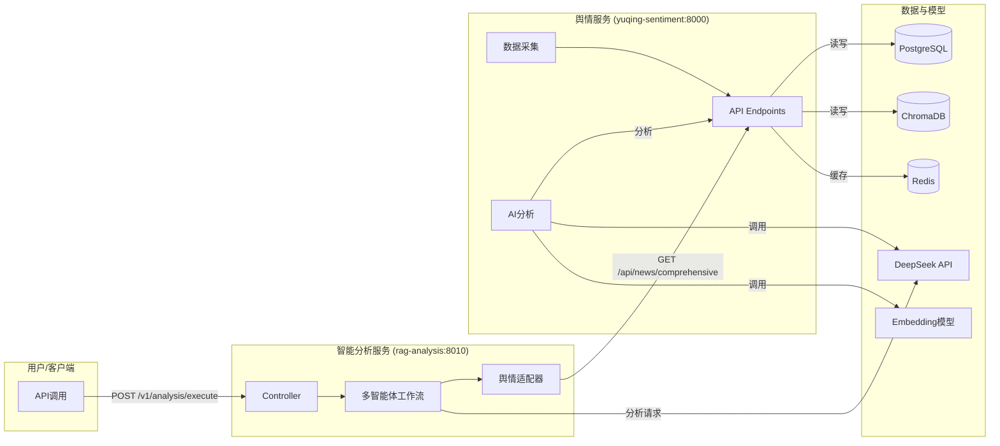

## 产品说明书：智策 (InsightFolio) - RAG+Agent 股票舆情分析平台

### 执行摘要 (Executive Summary)
- **定位**: 面向专业投研团队与个人投资者的A股舆情分析与投资决策辅助平台。
- **核心技术**: 采用RAG（检索增强生成）与多智能体（Multi-Agent）方法，融合多源新闻、情感/实体识别与多视角辩证推理。
- **核心服务**:
  - **舆情服务 (`apps/yuqing-sentiment`, 端口 8000)**: 负责多源数据采集、AI分析与结构化存储。
  - **分析服务 (`apps/rag-analysis`, 端口 8010)**: 负责多智能体决策编排与深度分析。
- **快速可用**: 提供`docker-compose`和统一的本地启动脚本，配备完整的API文档和模型训练指南。

### 产品价值主张
- **A股特化检索**: 通过对比学习（难负样本）提升语义冲突识别能力，降低“表述相似，影响相反”的误判。
- **多智能体辩证推理**: 模拟投研团队（叙事、量化、风控、宏观等）进行多角度分析，输出结构化、可解释的结论。
- **实时多源舆情融合**: 整合财联社、Google News等实时数据，进行实体级（公司/人物/行业/事件）影响追踪。
- **企业级工程化**: 基于FastAPI的微服务架构，使用PostgreSQL, Redis, ChromaDB，确保系统稳定、可扩展和易于运维。

## 功能总览

### 1. 舆情服务 (`apps/yuqing-sentiment`)
- **多源采集**:
  - 财联社 (`src/yuqing/services/cailian_news_service.py`)
  - Google News (`src/yuqing/services/google_news_service.py`)
- **AI分析**:
  - 基于DeepSeek的情感/市场影响判定、摘要、关键词提取。
  - 实体识别：公司、人物、行业、事件。
- **存储与检索**:
  - **结构化数据**: PostgreSQL (`src/yuqing/core/database.py`)
  - **向量数据**: ChromaDB (`src/yuqing/core/vector_store.py`)
  - **缓存**: Redis (`src/yuqing/core/cache.py`)
- **核心API**:
  - `GET /api/news/comprehensive`: 获取已分析的综合新闻数据。
  - `POST /api/news/cailian/fetch`: 手动触发财联社新闻采集。
  - `GET /api/entities/companies`: 查询公司实体的情感和影响。
  - `POST /api/entities/entities/extract`: 对任意文本进行实体提取。

### 2. 智能分析服务 (`apps/rag-analysis`)
- **多智能体工作流** (`src/services/graph_workflow.py`):
  - 基于`LangGraph`构建，模拟投研团队的辩证分析过程。
  - **八大核心角色**: 数据情报专家、叙事套利者、量化分析师、逆向怀疑论者、二级效应策略师、宏观策略师、风控官、首席整合官。
- **舆情数据适配器** (`src/services/yuqing_adapter.py`):
  - 调用舆情服务的API，将数据转换为分析服务所需的标准格式。
- **核心API**:
  - `POST /v1/analysis/execute`: 接收分析请求，启动多智能体工作流，返回结构化的投资决策建议。

### 3. RAG模型训练与评估
- **一键训练脚本**: `python tools/development/quick_train_test.py --full-pipeline`
- **A股特化**: 针对A股市场的8大类、30+组难负样本进行对比学习训练。
- **监控与评估**: 集成TensorBoard进行实时监控，并自动生成评估报告。

## 系统架构
- **服务框架**: FastAPI
- **数据存储**: PostgreSQL, ChromaDB, Redis
- **AI模型**: DeepSeek (LLM), BGE (Embedding)
- **部署**: Docker Compose



## 部署与运行
### Docker Compose (推荐)
```bash
# 启动所有服务和基础设施
docker-compose up -d

# 访问服务文档
# 舆情服务: http://localhost:8000/docs
# 分析服务: http://localhost:8010/docs
```

### 本地开发启动
```bash
# 启动所有服务
python scripts/start_all.py

# 停止所有服务
# (在start_all.py的终端中按Ctrl+C)
```

## 运维与监控
- **健康检查**: 每个服务都提供健康检查端点 (`/health` 或 `/`)。
- **日志**: 所有服务的日志都输出到 `logs/` 目录下的对应文件中。
- **数据治理**: 舆情服务包含定期数据清理机制 (`src/yuqing/services/data_cleanup_service.py`)。

## 路线图
- **近期**: 完善LLM网关、优化RAG分层索引。
- **中期**: 开发策略回测接口、提供标准化的情感/事件因子。
- **前端**: 开发面向专业用户的Pro版和面向普通用户的Lite版。

---
*本文档为当前项目状态的准确描述，旨在提供清晰、全面的产品概览。*


